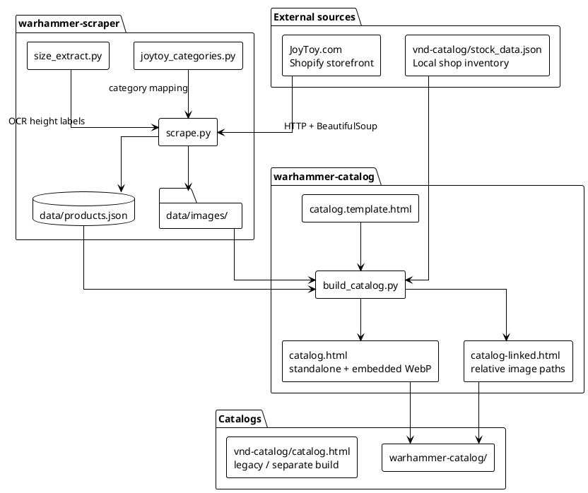

# JoyToy Warhammer Catalog

A local toolchain for scraping the [JoyToy Warhammer Action Figure](https://joytoy.com/collections/warhammer-action-figure) collection, enriching product metadata, and building a browsable offline catalog with optional Vietnamese shop inventory.

The pipeline turns public JoyToy product pages into structured JSON, local image assets, and self-contained HTML catalogs you can open in a browser without a server.

## Architecture



### Data flow

1. **Scrape** — `scrape.py` walks the Warhammer collection (541 products across paginated listing pages), fetches each product page, and persists metadata plus downloaded gallery and description images.
2. **Enrich** — Optional post-processing assigns JoyToy sidebar categories, parses figure dimensions from HTML, and runs OCR on marketing photos to recover heights (e.g. “20cm action figure”).
3. **Build** — `build_catalog.py` merges scraper output with `vnd-catalog/stock_data.json` (matched by UPC/SKU), groups products into factions, and injects JSON + images into `catalog.template.html`.
4. **Browse** — Open `catalog.html` (fully portable, images inlined as WebP data URIs) or `catalog-linked.html` (smaller file, requires local image paths).

## Tech stack

| Layer | Technology |
|-------|------------|
| Language | Python 3 |
| HTTP / parsing | `requests`, `beautifulsoup4` |
| Images | `Pillow` (resize, WebP embed), optional `pytesseract` + `numpy` (OCR) |
| Data | JSON on disk |
| Frontend | Static HTML/CSS/vanilla JS (no framework, no build step) |
| Storage | Git LFS for large generated `catalog.html` |

## Repository layout

```
joytoy/
├── warhammer-scraper/          # Scraper + enrichment utilities
│   ├── scrape.py               # Main scraper CLI
│   ├── joytoy_categories.py    # JoyToy faction/category definitions
│   ├── size_extract.py         # Marketing-image OCR for heights
│   ├── requirements.txt
│   └── data/
│       ├── products.json       # Scraped product catalog
│       └── images/             # Per-product image folders
├── warhammer-catalog/          # Catalog builder + outputs
│   ├── build_catalog.py        # Assembles HTML from template + data
│   ├── catalog.template.html   # UI shell (search, filters, bilingual)
│   ├── catalog.html            # Standalone build (LFS)
│   └── catalog-linked.html     # Linked-image build
└── vnd-catalog/                # Vietnamese shop data
    ├── stock_data.json         # SKU, qty, VND price, deposit
    └── catalog.html            # Separate catalog variant
```

## Quick start

### 1. Scraper setup

```bash
cd warhammer-scraper
python3 -m venv .venv
source .venv/bin/activate
pip install -r requirements.txt
```

### 2. Scrape products

```bash
python scrape.py                  # full run (resumes by default)
python scrape.py --limit 5        # smoke test
python scrape.py --no-images      # metadata only
```

Optional enrichment (run after scraping):

```bash
python scrape.py --scrape-categories
python scrape.py --extract-marketing-sizes
python scrape.py --fix-sizes
```

### 3. Build catalog

```bash
cd ../warhammer-catalog
python build_catalog.py           # catalog.html (standalone)
python build_catalog.py --linked  # catalog-linked.html (faster, smaller)
```

Open the generated HTML file in a browser. The standalone catalog embeds compressed WebP images so it can be shared as a single file; use `--image-scope thumb` for a smaller build.

## Product data model

Each scraped product includes:

- Identity: `name`, `slug`, `url`, `sku`
- Pricing: `price_usd`, `price_currency`, `availability`
- Specs: `size_cm`, `height_inches`, dimensions, `scale`, `material`, `applicable_age`
- Media: `images`, `description_images`, and local paths after download
- Categories: `joytoy_category` (when mapped from JoyToy collection pages)

When `vnd-catalog/stock_data.json` is present, matching products gain a `stock` block with VND price, quantity, and deposit for in-shop display.

## Notes

- The scraper uses polite delays between requests (`--delay`, default 1s). Respect JoyToy’s terms of service when scraping.
- OCR for marketing sizes requires Tesseract installed on the system (`pytesseract` is a Python wrapper only).
- Large generated assets (`catalog.html`) are tracked with Git LFS; clone with LFS enabled for full files.
